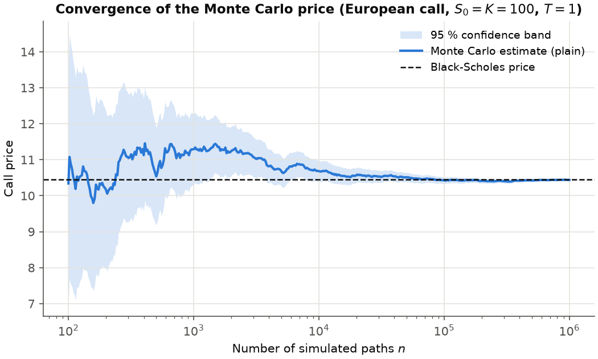
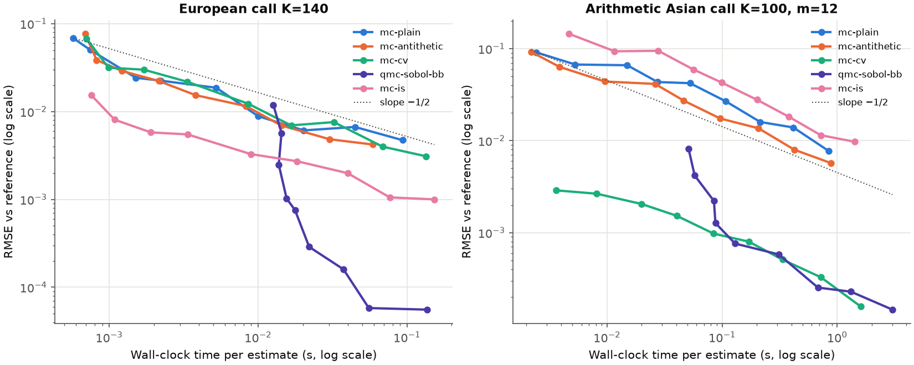
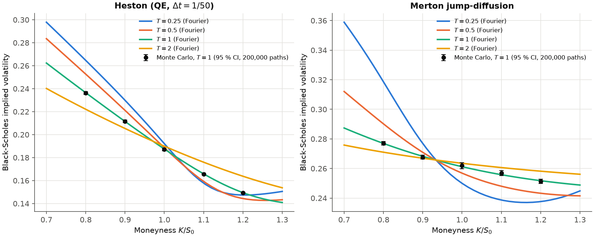
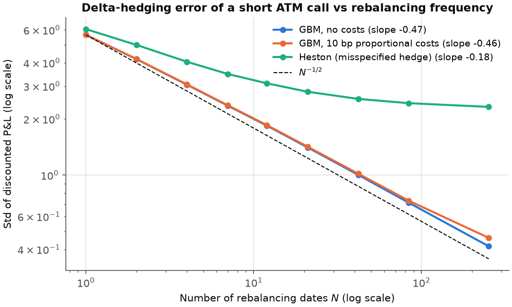
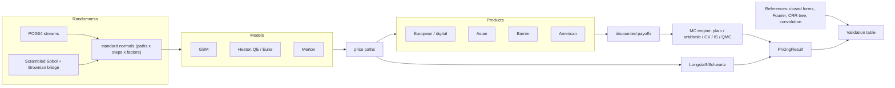

# monte-carlo-pricing-engine

**A research-grade Monte Carlo engine for pricing and hedging derivatives in Python. Every
Monte Carlo result is validated against an independent reference.**

[](https://github.com/surmanelie/monte-carlo-pricing-engine/actions/workflows/ci.yml)
<!-- BEGIN:coverage-badge -->
[](https://github.com/surmanelie/monte-carlo-pricing-engine/actions/workflows/ci.yml)
<!-- END:coverage-badge -->
[](https://www.python.org/)
[](LICENSE)
[](https://surmanelie.github.io/monte-carlo-pricing-engine/)

`mcengine` prices European, digital, Asian, barrier and American options under the
Black-Scholes, Heston and Merton jump-diffusion models. It supports plain, antithetic,
control-variate, importance-sampling and randomised quasi-Monte Carlo estimators. It
computes Greeks three ways, simulates discrete delta hedging and calibrates Heston to an
implied-volatility surface. Each estimator is checked against a closed form, a Fourier
inversion, a binomial tree or a recursive convolution, with errors reported in standard
errors.

**Documentation:** <https://surmanelie.github.io/monte-carlo-pricing-engine/>

## Highlights

All numbers below are produced by `mcengine validate`, `mcengine figures` and
`mcengine benchmark`, then inserted by `scripts/render_readme.py`.

<!-- BEGIN:highlights -->
- **European call:** with 100,000 simulated paths, the Monte Carlo price is 10.5628, within 1.07% of the Black-Scholes price 10.4506 (+2.39 standard errors).
- **Validation:** 72/72 Monte Carlo estimators agree with an independent reference within 4 SE; 71/72 references lie inside the 99 % confidence interval. RMSE decays with fitted slopes -0.478 (plain), -0.514 (antithetic), -0.511 (control variate) vs the theoretical -0.5.
- **Variance reduction:** the geometric control variate divides the variance of the arithmetic Asian by 1,254; importance sampling divides that of a K = 180 call by 476; randomised QMC with a Brownian bridge divides that of a K = 140 call by 24,043.
- **American put (Longstaff-Schwartz):** 4.4732 ± 0.0092 vs 4.4778 for the Bermudan CRR tree (S0 = 36, sigma = 0.2, T = 1); over the 12 cases of Longstaff & Schwartz's Table 1 the largest error is 2.12 SE.
- **Heston:** in a Feller-violating case (ratio 0.04), full-truncation Euler is still biased by +0.276 at dt = 1/32, while Andersen's QE is at +0.029 (SE 0.021).
- **Delta hedging:** the std of the hedging error scales like N^-0.47 under GBM, but only like N^-0.18 when a Heston world is hedged with Black-Scholes deltas.
- **Calibration:** Heston fitted to a noisy synthetic surface (36 quotes, 10 bp noise) with an implied-vol RMSE of 8.2 bp in 2.0 s; rho recovered as -0.701 (true -0.700).
<!-- END:highlights -->

## Key figures

| Convergence with 95 % confidence band | Error vs wall-clock time |
|---|---|
|  |  |
| **Heston and Merton implied-volatility smiles** (lines: Fourier; dots: Monte Carlo) | **Delta-hedging error vs rebalancing frequency** |
|  |  |

More figures (barrier monitoring bias, early-exercise boundary, Heston QE vs Euler, Greeks,
hedging P&L histograms, calibration) are on the
[results page](https://surmanelie.github.io/monte-carlo-pricing-engine/results/).

## Features

| Category | Content |
|---|---|
| **Models** | Black-Scholes GBM (exact), Heston (Andersen QE with martingale correction; full-truncation Euler), Merton jump-diffusion (exact) |
| **Products** | European call/put, cash-or-nothing digital, Asian (arithmetic/geometric, discrete), 8 single barriers (discrete monitoring, BGK correction, Brownian-bridge estimator), American/Bermudan put and call |
| **Monte Carlo** | Plain, antithetic, control variates (terminal price, geometric Asian), importance sampling (Girsanov drift), randomised QMC (scrambled Sobol + Brownian bridge), Longstaff-Schwartz; chunked constant-memory streaming statistics |
| **References** | Black-Scholes, Kemna-Vorst, Reiner-Rubinstein, Merton series, Gil-Pelaez ("little Heston trap"), Carr-Madan FFT, CRR tree with BBS-Richardson, recursive convolution for arithmetic Asians |
| **Greeks** | Closed form; bump-and-revalue with common random numbers, pathwise, likelihood ratio, all with standard errors |
| **Hedging** | Discrete delta hedging, proportional costs, GBM and misspecified Heston dynamics |
| **Volatility & calibration** | Vectorised implied vol (Newton + Brent, arbitrage bounds); Heston calibration by weighted least squares on implied vols, Feller diagnostic, optional user CSV |
| **Tooling** | Typer CLI, Streamlit dashboard, MkDocs site, `mypy --strict`, ruff, pytest + Hypothesis, coverage ≥ 90 %, optional Numba backend, pytest-benchmark |

## Validation table

`scripts/validate.py` (or `mcengine validate`) compares every Monte Carlo estimator with an
independent reference. *Pass* means |error| < 4 SE. *In 99 % CI* reports whether the
reference lies in the 99 % confidence interval. Seeds are fixed once per case and never
re-drawn, so with many rows about 1 % of references are expected outside the 99 % interval
by chance.

<!-- BEGIN:validation -->
| Model | Product | Method | Paths | Steps | MC price | 95 % CI | Reference | Ref. method | Error (SE) | In 99 % CI | Pass |
|---|---|---|--:|--:|--:|---|--:|---|--:|:-:|:-:|
| GBM | European call K=100 T=1 | `mc-plain` | 100,000 | 1 | 10.5628 | [10.4708, 10.6548] | 10.4506 | Black-Scholes | +2.39 | yes | ✅ |
| GBM | European call K=100 T=1 | `mc-antithetic` | 100,000 | 1 | 10.4604 | [10.3959, 10.5250] | 10.4506 | Black-Scholes | +0.30 | yes | ✅ |
| GBM | European call K=100 T=1 | `mc-cv` | 100,000 | 1 | 10.4743 | [10.4395, 10.5092] | 10.4506 | Black-Scholes | +1.34 | yes | ✅ |
| GBM | European call K=120 T=1 | `mc-plain` | 100,000 | 1 | 3.2346 | [3.1810, 3.2882] | 3.2475 | Black-Scholes | -0.47 | yes | ✅ |
| GBM | European call K=120 T=1 | `mc-antithetic` | 100,000 | 1 | 3.2300 | [3.1798, 3.2802] | 3.2475 | Black-Scholes | -0.68 | yes | ✅ |
| GBM | European call K=120 T=1 | `mc-cv` | 100,000 | 1 | 3.1934 | [3.1584, 3.2284] | 3.2475 | Black-Scholes | -3.03 | no | ✅ |
| GBM | European put K=100 T=1 | `mc-plain` | 100,000 | 1 | 5.6168 | [5.5629, 5.6707] | 5.5735 | Black-Scholes | +1.57 | yes | ✅ |
| GBM | European put K=100 T=1 | `mc-antithetic` | 100,000 | 1 | 5.5664 | [5.5254, 5.6074] | 5.5735 | Black-Scholes | -0.34 | yes | ✅ |
| GBM | European put K=100 T=1 | `mc-cv` | 100,000 | 1 | 5.5844 | [5.5497, 5.6192] | 5.5735 | Black-Scholes | +0.61 | yes | ✅ |
| GBM | Digital call K=100 T=1 | `mc-plain` | 100,000 | 1 | 0.5339 | [0.5310, 0.5368] | 0.5323 | e^{-rT} N(d2) | +1.05 | yes | ✅ |
| GBM | Digital call K=100 T=1 | `mc-cv` | 100,000 | 1 | 0.5333 | [0.5315, 0.5352] | 0.5323 | e^{-rT} N(d2) | +1.07 | yes | ✅ |
| GBM | Asian geome. call K=100 T=1 m=12 | `mc-plain` | 100,000 | 12 | 5.9115 | [5.8605, 5.9625] | 5.9402 | Kemna-Vorst | -1.10 | yes | ✅ |
| GBM | Asian geome. call K=100 T=1 m=12 | `mc-antithetic` | 100,000 | 12 | 5.9135 | [5.8781, 5.9490] | 5.9402 | Kemna-Vorst | -1.47 | yes | ✅ |
| GBM | Asian arith. call K=100 T=1 m=12 | `mc-plain` | 100,000 | 12 | 6.1446 | [6.0919, 6.1972] | 6.1560 | Recursive convolution | -0.43 | yes | ✅ |
| GBM | Asian arith. call K=100 T=1 m=12 | `mc-antithetic` | 100,000 | 12 | 6.1492 | [6.1126, 6.1857] | 6.1560 | Recursive convolution | -0.37 | yes | ✅ |
| GBM | Asian arith. call K=100 T=1 m=12 | `mc-cv` | 100,000 | 12 | 6.1563 | [6.1548, 6.1578] | 6.1560 | Recursive convolution | +0.38 | yes | ✅ |
| GBM | Asian arith. put K=100 T=1 m=12 | `mc-cv` | 100,000 | 12 | 3.5345 | [3.5336, 3.5354] | 3.5345 | Recursive convolution | +0.04 | yes | ✅ |
| GBM | Asian arith. call K=100 T=1 m=52 | `mc-cv` | 100,000 | 52 | 5.8544 | [5.8530, 5.8557] | 5.8539 | Recursive convolution | +0.71 | yes | ✅ |
| GBM | down-and-out call K=100 H=90 T=1 | `mc-plain` | 100,000 | 50 | 8.6471 | [8.5579, 8.7363] | 8.6655 | Reiner-Rubinstein | -0.40 | yes | ✅ |
| GBM | down-and-out put K=100 H=90 T=1 | `mc-plain` | 100,000 | 50 | 0.1547 | [0.1499, 0.1595] | 0.1512 | Reiner-Rubinstein | +1.43 | yes | ✅ |
| GBM | down-and-in call K=100 H=90 T=1 | `mc-plain` | 100,000 | 50 | 1.7820 | [1.7479, 1.8161] | 1.7851 | Reiner-Rubinstein | -0.18 | yes | ✅ |
| GBM | down-and-in put K=100 H=90 T=1 | `mc-plain` | 100,000 | 50 | 5.3827 | [5.3290, 5.4365] | 5.4223 | Reiner-Rubinstein | -1.44 | yes | ✅ |
| GBM | up-and-out call K=100 H=120 T=1 | `mc-plain` | 100,000 | 50 | 1.1798 | [1.1613, 1.1984] | 1.1761 | Reiner-Rubinstein | +0.40 | yes | ✅ |
| GBM | up-and-out put K=100 H=120 T=1 | `mc-plain` | 100,000 | 50 | 5.3772 | [5.3237, 5.4307] | 5.3601 | Reiner-Rubinstein | +0.63 | yes | ✅ |
| GBM | up-and-in call K=100 H=120 T=1 | `mc-plain` | 100,000 | 50 | 9.2409 | [9.1476, 9.3343] | 9.2745 | Reiner-Rubinstein | -0.70 | yes | ✅ |
| GBM | up-and-in put K=100 H=120 T=1 | `mc-plain` | 100,000 | 50 | 0.2150 | [0.2060, 0.2241] | 0.2134 | Reiner-Rubinstein | +0.36 | yes | ✅ |
| GBM S0=36 σ=0.2 | American put K=40 T=1 (50 dates) | `lsm` | 100,000 | 50 | 4.4732 | [4.4552, 4.4911] | 4.4778 | CRR Bermudan tree (N=5000, BBS-Richardson) | -0.51 | yes | ✅ |
| GBM S0=36 σ=0.2 | American put K=40 T=2 (100 dates) | `lsm` | 100,000 | 100 | 4.8238 | [4.8021, 4.8456] | 4.8402 | CRR Bermudan tree (N=10000, BBS-Richardson) | -1.47 | yes | ✅ |
| GBM S0=36 σ=0.4 | American put K=40 T=1 (50 dates) | `lsm` | 100,000 | 50 | 7.0942 | [7.0569, 7.1315] | 7.1013 | CRR Bermudan tree (N=5000, BBS-Richardson) | -0.37 | yes | ✅ |
| GBM S0=36 σ=0.4 | American put K=40 T=2 (100 dates) | `lsm` | 100,000 | 100 | 8.5025 | [8.4583, 8.5466] | 8.5068 | CRR Bermudan tree (N=10000, BBS-Richardson) | -0.19 | yes | ✅ |
| GBM S0=40 σ=0.2 | American put K=40 T=1 (50 dates) | `lsm` | 100,000 | 50 | 2.3063 | [2.2893, 2.3232] | 2.3141 | CRR Bermudan tree (N=5000, BBS-Richardson) | -0.90 | yes | ✅ |
| GBM S0=40 σ=0.2 | American put K=40 T=2 (100 dates) | `lsm` | 100,000 | 100 | 2.8943 | [2.8735, 2.9151] | 2.8846 | CRR Bermudan tree (N=10000, BBS-Richardson) | +0.92 | yes | ✅ |
| GBM S0=40 σ=0.4 | American put K=40 T=1 (50 dates) | `lsm` | 100,000 | 50 | 5.2793 | [5.2440, 5.3146] | 5.3120 | CRR Bermudan tree (N=5000, BBS-Richardson) | -1.82 | yes | ✅ |
| GBM S0=40 σ=0.4 | American put K=40 T=2 (100 dates) | `lsm` | 100,000 | 100 | 6.9135 | [6.8707, 6.9562] | 6.9171 | CRR Bermudan tree (N=10000, BBS-Richardson) | -0.17 | yes | ✅ |
| GBM S0=44 σ=0.2 | American put K=40 T=1 (50 dates) | `lsm` | 100,000 | 50 | 1.1181 | [1.1052, 1.1311] | 1.1099 | CRR Bermudan tree (N=5000, BBS-Richardson) | +1.25 | yes | ✅ |
| GBM S0=44 σ=0.2 | American put K=40 T=2 (100 dates) | `lsm` | 100,000 | 100 | 1.6714 | [1.6545, 1.6884] | 1.6898 | CRR Bermudan tree (N=10000, BBS-Richardson) | -2.12 | yes | ✅ |
| GBM S0=44 σ=0.4 | American put K=40 T=1 (50 dates) | `lsm` | 100,000 | 50 | 3.9597 | [3.9276, 3.9918] | 3.9477 | CRR Bermudan tree (N=5000, BBS-Richardson) | +0.74 | yes | ✅ |
| GBM S0=44 σ=0.4 | American put K=40 T=2 (100 dates) | `lsm` | 100,000 | 100 | 5.6122 | [5.5720, 5.6524] | 5.6412 | CRR Bermudan tree (N=10000, BBS-Richardson) | -1.42 | yes | ✅ |
| GBM S0=40 σ=0.2 | American call K=40 T=1 (50 dates) | `lsm` | 100,000 | 50 | 4.4212 | [4.3840, 4.4585] | 4.3958 | Black-Scholes (no early exercise) | +1.34 | yes | ✅ |
| Heston QE (Δt = 1/50) | European call K=90 T=1 | `mc-plain` | 100,000 | 50 | 15.7310 | [15.6489, 15.8132] | 15.7717 | Gil-Pelaez (little trap) | -0.97 | yes | ✅ |
| Heston QE (Δt = 1/50) | European call K=100 T=1 | `mc-plain` | 100,000 | 50 | 8.9515 | [8.8870, 9.0161] | 8.9294 | Gil-Pelaez (little trap) | +0.67 | yes | ✅ |
| Heston QE (Δt = 1/50) | European call K=110 T=1 | `mc-plain` | 100,000 | 50 | 3.9796 | [3.9358, 4.0234] | 3.9785 | Gil-Pelaez (little trap) | +0.05 | yes | ✅ |
| Heston QE (Δt = 1/50) | European call K=100 T=1 | `mc-antithetic` | 100,000 | 50 | 8.9599 | [8.9170, 9.0029] | 8.9294 | Gil-Pelaez (little trap) | +1.39 | yes | ✅ |
| Heston QE (Δt = 1/50) | European put K=100 T=1 | `mc-cv` | 100,000 | 50 | 5.9467 | [5.9120, 5.9815] | 5.9740 | Gil-Pelaez (little trap) | -1.54 | yes | ✅ |
| Heston Euler FT (Δt = 1/200) | European call K=100 T=1 | `mc-plain` | 100,000 | 200 | 8.9819 | [8.9174, 9.0465] | 8.9294 | Gil-Pelaez (little trap) | +1.59 | yes | ✅ |
| Merton | European call K=80 T=1 | `mc-plain` | 100,000 | 1 | 26.0874 | [25.9430, 26.2318] | 25.9555 | Merton series | +1.79 | yes | ✅ |
| Merton | European call K=100 T=1 | `mc-plain` | 100,000 | 1 | 12.7965 | [12.6826, 12.9105] | 12.7613 | Merton series | +0.61 | yes | ✅ |
| Merton | European call K=120 T=1 | `mc-plain` | 100,000 | 1 | 5.0374 | [4.9624, 5.1125] | 5.0906 | Merton series | -1.39 | yes | ✅ |
| Merton | European call K=100 T=1 | `mc-cv` | 100,000 | 1 | 12.7585 | [12.7113, 12.8057] | 12.7613 | Merton series | -0.12 | yes | ✅ |
| Merton | European put K=100 T=1 | `mc-antithetic` | 100,000 | 1 | 7.9331 | [7.8736, 7.9925] | 7.8842 | Merton series | +1.61 | yes | ✅ |
| GBM | European call K=100 T=1: delta | `mc-bump` | 100,000 | 1 | 0.6369 | [0.6334, 0.6405] | 0.6368 | Black-Scholes delta | +0.05 | yes | ✅ |
| GBM | European call K=100 T=1: delta | `mc-pathwise` | 100,000 | 1 | 0.6363 | [0.6327, 0.6398] | 0.6368 | Black-Scholes delta | -0.32 | yes | ✅ |
| GBM | European call K=100 T=1: delta | `mc-lr` | 100,000 | 1 | 0.6434 | [0.6342, 0.6525] | 0.6368 | Black-Scholes delta | +1.40 | yes | ✅ |
| GBM | European call K=100 T=1: gamma | `mc-bump` | 100,000 | 1 | 0.0190 | [0.0183, 0.0196] | 0.0188 | Black-Scholes gamma | +0.61 | yes | ✅ |
| GBM | European call K=100 T=1: gamma | `mc-pathwise` | 100,000 | 1 | 0.0187 | [0.0185, 0.0189] | 0.0188 | Black-Scholes gamma | -0.57 | yes | ✅ |
| GBM | European call K=100 T=1: gamma | `mc-lr` | 100,000 | 1 | 0.0189 | [0.0180, 0.0197] | 0.0188 | Black-Scholes gamma | +0.21 | yes | ✅ |
| GBM | European call K=100 T=1: vega | `mc-bump` | 100,000 | 1 | 37.4369 | [36.9689, 37.9049] | 37.5240 | Black-Scholes vega | -0.36 | yes | ✅ |
| GBM | European call K=100 T=1: vega | `mc-pathwise` | 100,000 | 1 | 37.7906 | [37.3173, 38.2639] | 37.5240 | Black-Scholes vega | +1.10 | yes | ✅ |
| GBM | European call K=100 T=1: vega | `mc-lr` | 100,000 | 1 | 37.8512 | [36.1463, 39.5561] | 37.5240 | Black-Scholes vega | +0.38 | yes | ✅ |
| GBM | Digital call K=100 T=1: delta | `mc-bump` | 100,000 | 1 | 0.0195 | [0.0189, 0.0201] | 0.0188 | Black-Scholes delta | +2.43 | yes | ✅ |
| GBM | Digital call K=100 T=1: delta | `mc-lr` | 100,000 | 1 | 0.0187 | [0.0185, 0.0188] | 0.0188 | Black-Scholes delta | -1.14 | yes | ✅ |
| GBM | Digital call K=100 T=1: gamma | `mc-lr` | 100,000 | 1 | -0.0003 | [-0.0003, -0.0003] | -0.0003 | Black-Scholes gamma | +0.85 | yes | ✅ |
| GBM | Digital call K=100 T=1: vega | `mc-lr` | 100,000 | 1 | -0.6371 | [-0.6654, -0.6087] | -0.6567 | Black-Scholes vega | +1.36 | yes | ✅ |
| GBM | European call K=100 T=1 | `qmc-sobol-bb` | 131,072 | 1 | 10.4509 | [10.4502, 10.4516] | 10.4506 | Black-Scholes | +0.85 | yes | ✅ |
| GBM | Asian arith. call K=100 T=1 m=12 | `qmc-sobol-bb` | 131,072 | 12 | 6.1559 | [6.1550, 6.1569] | 6.1560 | Recursive convolution | -0.22 | yes | ✅ |
| GBM | down-and-out call K=100 H=90 T=1 | `qmc-sobol-bb` | 131,072 | 50 | 8.6714 | [8.6626, 8.6802] | 8.6655 | Reiner-Rubinstein | +1.31 | yes | ✅ |
| GBM | European call K=140 T=1 | `mc-is` | 100,000 | 1 | 0.7804 | [0.7749, 0.7858] | 0.7850 | Black-Scholes | -1.67 | yes | ✅ |
| GBM | European call K=180 T=1 | `mc-is` | 100,000 | 1 | 0.0287 | [0.0285, 0.0290] | 0.0286 | Black-Scholes | +0.92 | yes | ✅ |
| GBM | Digital call K=150 T=1 | `mc-is` | 100,000 | 1 | 0.0286 | [0.0283, 0.0288] | 0.0288 | e^{-rT} N(d2) | -1.33 | yes | ✅ |
| Heston QE (Δt = 1/50) | European call K=100 T=1 | `qmc-sobol-bb` | 131,072 | 50 | 8.9274 | [8.9180, 8.9368] | 8.9294 | Gil-Pelaez (little trap) | -0.42 | yes | ✅ |
| Heston QE, Numba (Δt = 1/50) | European call K=100 T=1 | `mc-plain` | 100,000 | 50 | 8.8828 | [8.8185, 8.9471] | 8.9294 | Gil-Pelaez (little trap) | -1.42 | yes | ✅ |
| Merton | European call K=100 T=1 | `qmc-sobol-bb` | 131,072 | 1 | 12.7592 | [12.7573, 12.7612] | 12.7613 | Merton series | -2.04 | yes | ✅ |

72/72 rows pass (|error| < 4 SE); 71/72 references lie inside the 99% confidence interval (about 0.7 misses expected by chance for unbiased estimators).
<!-- END:validation -->

Are the standard errors themselves correct? Each estimator below was re-run with
independent seeds. For an unbiased estimator with honest standard errors, coverage is
near 95 % / 99 % and the errors in SE units have mean ≈ 0 and standard deviation ≈ 1.

<!-- BEGIN:coverage-study -->
| Model | Product | Method | Paths | Seeds | Coverage 95 % CI | Coverage 99 % CI | Mean error (SE) | Std error (SE) |
|---|---|---|--:|--:|--:|--:|--:|--:|
| GBM | European call K=100 T=1 | `mc-plain` | 20,000 | 1000 | 94.5% | 98.7% | -0.041 | 1.001 |
| GBM | European call K=100 T=1 | `mc-antithetic` | 20,000 | 1000 | 95.5% | 98.6% | -0.012 | 1.000 |
| GBM | European call K=100 T=1 | `mc-cv` | 20,000 | 1000 | 94.9% | 98.9% | -0.040 | 1.003 |
| GBM | European call K=120 T=1 | `mc-cv` | 20,000 | 1000 | 95.4% | 99.1% | -0.003 | 0.978 |
| GBM | Digital call K=100 T=1 | `mc-plain` | 20,000 | 1000 | 95.7% | 98.9% | -0.012 | 0.987 |
| GBM | Asian arith. call K=100 T=1 m=12 | `mc-cv` | 20,000 | 1000 | 94.1% | 98.4% | -0.026 | 1.020 |
| GBM | down-and-out call K=100 H=90 T=1 | `mc-plain` | 20,000 | 1000 | 94.5% | 99.0% | -0.049 | 1.023 |
| Merton | European call K=100 T=1 | `mc-plain` | 20,000 | 1000 | 95.3% | 98.9% | +0.011 | 1.012 |
| GBM | European call K=100 T=1: gamma | `mc-pathwise` | 20,000 | 1000 | 94.9% | 99.3% | -0.022 | 0.998 |
| GBM | Digital call K=100 T=1: gamma | `mc-lr` | 20,000 | 1000 | 95.2% | 99.3% | +0.011 | 0.980 |
| GBM | European call K=140 T=1 | `mc-is` | 20,000 | 1000 | 94.0% | 98.3% | -0.037 | 1.034 |
<!-- END:coverage-study -->

## Installation

```bash
git clone https://github.com/surmanelie/monte-carlo-pricing-engine.git
cd monte-carlo-pricing-engine
pip install -e ".[dev]"      # library + CLI + tests
pip install -e ".[fast]"     # optional Numba kernels
pip install -e ".[app]"      # Streamlit dashboard
pip install -e ".[docs]"     # MkDocs site
```

Requires Python ≥ 3.11. Core dependencies: NumPy, SciPy, Matplotlib (and Typer/Rich for
the CLI).

## Quick start

### Command line

<!-- BEGIN:cli-output -->
```console
$ mcengine price --model gbm --product european --type call --K 100 --n 100000
      European call K=100 T=1 under GBM       
┌────────────────┬───────────────────────────┐
│ Quantity       │                     Value │
├────────────────┼───────────────────────────┤
│ Method         │                  mc-plain │
│ Price          │                 10.420541 │
│ Standard error │                  0.046770 │
│ 95 % CI        │    [10.328874, 10.512209] │
│ Paths          │                   100,000 │
│ Time steps     │                         1 │
│ Elapsed        │                   0.013 s │
│ Reference      │ 10.450584 (Black-Scholes) │
│ Error (SE)     │                     -0.64 │
│ Inside 99 % CI │                       yes │
└────────────────┴───────────────────────────┘
```
<!-- END:cli-output -->

Other examples:

```bash
mcengine price --model heston --product barrier --type down-and-out-call --K 100 --B 90 --n 1000000 --method qmc
mcengine price --model gbm --product american --type put --S0 36 --K 40 --r 0.06 --method lsm
mcengine price --model merton --product european --K 110 --method cv
mcengine calibrate --csv my_chain.csv --spot 100 --rate 0.02   # your own data, see docs
```

When no independent method exists for a model/product pair (e.g. barriers under Heston),
`mcengine price` says so explicitly instead of printing a reference.

### Python API

<!-- BEGIN:python-output -->
```python
from mcengine import GBM, EuropeanOption, price_mc, price_analytic

model = GBM(s0=100.0, r=0.05, sigma=0.2)
call = EuropeanOption(strike=100.0, maturity=1.0)
for method in ("plain", "antithetic", "cv", "qmc"):
    n = 16 * 2**13 if method == "qmc" else 100_000
    print(price_mc(model, call, n_paths=n, method=method, seed=42))
print(price_analytic(model, call))
```

Output:

```text
mc-plain: 10.420541 +/- 0.046770 (95% CI [10.328874, 10.512209], n=100000)
mc-antithetic: 10.467314 +/- 0.033077 (95% CI [10.402485, 10.532144], n=100000)
mc-cv: 10.466844 +/- 0.017875 (95% CI [10.431810, 10.501878], n=100000)
qmc-sobol-bb: 10.450955 +/- 0.000349 (95% CI [10.450271, 10.451639], n=131072)
bs-analytic: 10.450584
```
<!-- END:python-output -->

### Dashboard

```bash
pip install -e ".[app]"
streamlit run app/streamlit_app.py
```

The dashboard shows the price with its confidence interval, the reference and the error in
standard errors, a live convergence plot, sample paths, the implied-volatility smile and
the hedging P&L. Deployment on Streamlit Community Cloud is described in the
[docs](https://surmanelie.github.io/monte-carlo-pricing-engine/dashboard/).

## Architecture



Models consume a tensor of independent standard normals. The engine only changes how the
normals are generated, so every variance-reduction method works with every model.

```text
src/mcengine/
├── results.py, stats.py         PricingResult / GreeksResult, streaming moments
├── random/                      PCG64 streams, scrambled Sobol + Brownian bridge
├── models/                      GBM, Heston (QE, Euler), Merton
├── products/                    European, digital, Asian, barrier, American
├── engines/                     analytic, fourier, convolution, tree, monte_carlo, lsm
├── greeks/                      closed-form and Monte Carlo Greeks
├── hedging/                     discrete delta-hedging simulator
├── volatility/, calibration/    implied vol, Heston calibration
├── reporting/                   validation registry, figures, benchmarks
└── cli.py                       Typer CLI
```

## Benchmarks

<!-- BEGIN:benchmark -->
Measured on Intel64 Family 6 Model 154 Stepping 4, GenuineIntel (12 logical CPUs), Windows-11-10.0.26200-SP0, Python 3.12.14, NumPy 2.5.3, Numba 0.67.0.

| Model | Engine | Backend | Steps | Paths | Time (s) | Paths / s | Path-steps / s |
|---|---|---|--:|--:|--:|--:|--:|
| GBM (exact) | `mc-plain` | numpy | 1 | 1,000,000 | 0.096 | 10,412,480 | 10,412,480 |
| GBM (exact) | `mc-plain` | numpy | 252 | 100,000 | 1.417 | 70,549 | 17,778,315 |
| Heston QE | `mc-plain` | numpy | 252 | 100,000 | 5.453 | 18,338 | 4,621,172 |
| Heston QE | `mc-plain` | numba | 252 | 100,000 | 2.075 | 48,189 | 12,143,654 |
| Heston Euler FT | `mc-plain` | numpy | 252 | 100,000 | 3.590 | 27,853 | 7,019,064 |
| Merton (exact) | `mc-plain` | numpy | 252 | 100,000 | 5.240 | 19,085 | 4,809,371 |
| GBM, American put | `lsm` | numpy | 50 | 100,000 | 1.717 | 58,237 | 2,911,833 |
| GBM, American put | `lsm` | numba | 50 | 100,000 | 1.572 | 63,625 | 3,181,256 |

| Problem | Method | Paths | Std error | Time (s) | Variance reduction | Efficiency gain (var x time) |
|---|---|--:|--:|--:|--:|--:|
| European call K=140 | `mc-plain` | 1,048,576 | 4.14e-03 | 0.121 | 1.0 | 1.0 |
| European call K=140 | `mc-antithetic` | 1,048,576 | 4.07e-03 | 0.075 | 1.0 | 1.7 |
| European call K=140 | `mc-cv` | 1,048,576 | 3.54e-03 | 0.177 | 1.4 | 0.9 |
| European call K=140 | `qmc-sobol-bb` | 1,048,576 | 2.67e-05 | 0.183 | 24,043.0 | 15,861.6 |
| European call K=140 | `mc-is` | 1,048,576 | 8.54e-04 | 0.197 | 23.5 | 14.5 |
| Arithmetic Asian call K=100, m=12 | `mc-plain` | 1,048,576 | 8.31e-03 | 1.337 | 1.0 | 1.0 |
| Arithmetic Asian call K=100, m=12 | `mc-antithetic` | 1,048,576 | 5.75e-03 | 1.239 | 2.1 | 2.3 |
| Arithmetic Asian call K=100, m=12 | `mc-cv` | 1,048,576 | 2.32e-04 | 1.892 | 1,286.9 | 909.5 |
| Arithmetic Asian call K=100, m=12 | `qmc-sobol-bb` | 1,048,576 | 1.15e-04 | 2.758 | 5,236.4 | 2,539.1 |
| Arithmetic Asian call K=100, m=12 | `mc-is` | 1,048,576 | 9.80e-03 | 1.753 | 0.7 | 0.5 |
<!-- END:benchmark -->

## Calibration (synthetic surface)

<!-- BEGIN:calibration -->
| Parameter | True | Calibrated |
|---|--:|--:|
| v0 | 0.0400 | 0.0399 |
| kappa | 1.5000 | 1.5215 |
| theta | 0.0500 | 0.0499 |
| xi | 0.6000 | 0.5982 |
| rho | -0.7000 | -0.7007 |

Implied-vol RMSE 8.16 bp, max |error| 17.34 bp (noise 10 bp); Feller ratio of the fit 0.424.
<!-- END:calibration -->

## Reproducing the results

```bash
mcengine validate && mcengine figures && mcengine benchmark
pytest --cov --cov-report=json:results/coverage.json
python scripts/render_readme.py
```

These commands regenerate `results/*.md|json`, every PNG in `figures/`, and the generated
sections of this README. Seeds are fixed, so the statistical results are reproducible;
timings depend on the machine.

## References

- Glasserman, P. (2003). *Monte Carlo Methods in Financial Engineering*. Springer.
- Black, F., & Scholes, M. (1973). The pricing of options and corporate liabilities. *Journal of Political Economy*, 81(3).
- Merton, R. C. (1976). Option pricing when underlying stock returns are discontinuous. *Journal of Financial Economics*, 3(1-2).
- Heston, S. L. (1993). A closed-form solution for options with stochastic volatility. *Review of Financial Studies*, 6(2).
- Kemna, A. G. Z., & Vorst, A. C. F. (1990). A pricing method for options based on average asset values. *Journal of Banking & Finance*, 14(1).
- Reiner, E., & Rubinstein, M. (1991). Breaking down the barriers. *Risk*, 4(8).
- Broadie, M., Glasserman, P., & Kou, S. (1997). A continuity correction for discrete barrier options. *Mathematical Finance*, 7(4).
- Carr, P., & Madan, D. (1999). Option valuation using the fast Fourier transform. *Journal of Computational Finance*, 2(4).
- Longstaff, F. A., & Schwartz, E. S. (2001). Valuing American options by simulation: a simple least-squares approach. *Review of Financial Studies*, 14(1).
- Albrecher, H., Mayer, P., Schoutens, W., & Tistaert, J. (2007). The little Heston trap. *Wilmott Magazine*.
- Andersen, L. (2008). Simple and efficient simulation of the Heston stochastic volatility model. *Journal of Computational Finance*, 11(3).

The [documentation](https://surmanelie.github.io/monte-carlo-pricing-engine/references/) lists every reference used.

## License

MIT © Elie Surman. See [LICENSE](LICENSE).
