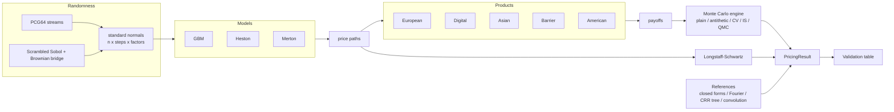

# mcengine

**A research-grade Monte Carlo engine for pricing and hedging derivatives, in which every
Monte Carlo result is validated against an independent reference.**

`mcengine` prices European, digital, Asian, barrier and American options under the
Black-Scholes (GBM), Heston and Merton jump-diffusion models, with plain, antithetic,
control-variate, importance-sampling and randomised quasi-Monte Carlo estimators. It
computes Greeks three ways, simulates discrete delta hedging, and calibrates Heston to an
implied-volatility surface.

## Design principles

1. **Independent validation.** Each Monte Carlo price is compared with a closed form
   (Black-Scholes, Kemna-Vorst, Reiner-Rubinstein, Merton), a Fourier inversion
   (Gil-Pelaez, Carr-Madan), a binomial tree or a recursive convolution. The error is
   reported in standard errors, and the calibration of the standard errors themselves is
   checked by a coverage study over hundreds of seeds ([Results](results.md)).
2. **No hand-written numbers.** Every table and figure is produced by
   `mcengine validate`, `mcengine figures` and `mcengine benchmark`.
3. **Reproducibility.** Every stochastic function takes `seed` and/or `rng`; chunked runs
   give the same estimate as a single chunk.
4. **Constant memory, vectorised NumPy.** Paths are processed in chunks with streaming
   moments (Chan-Golub-LeVeque); loops run only over time steps, never over paths
   (except in the optional Numba kernels, which compile them).

## Architecture

The key design choice is that **models consume a tensor of independent standard normals**
of shape `(paths, steps, factors)`. The engine only changes how those normals are
produced (pseudo-random, antithetic pairs, shifted for importance sampling, Sobol points
through a Brownian bridge), so every sampling method works with every model.

## Where to go next

- [Getting started](getting-started.md): installation, CLI and Python API.
- [Theory](theory/monte-carlo.md): formulas, algorithms and references for every component.
- [Results](results.md): validation table, coverage study, figures and benchmarks.
- [API reference](api/core.md): generated from the docstrings.
